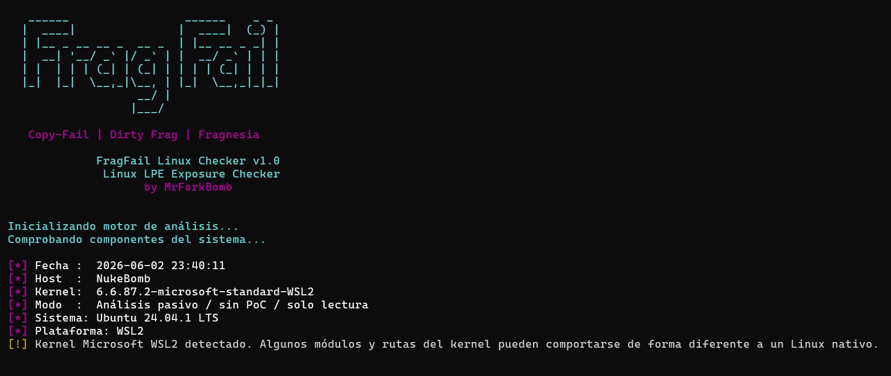

# **FragFail Linux Checker**

FragFail es na herramienta de análisis pasivo para detectar vulnerabilidades recientes de escalada local de privilegios (LPE) en Linux relacionadas con **Copy-Fail**, **Dirty Frag** y **Fragnesia**.

El objetivo de esta herramienta es ayudar a administradores, analistas de seguridad, equipos Blue Team y profesionales de ciberseguridad a identificar de forma rápida si un sistema Linux dispone de posibles superficies de ataque asociadas a estas vulnerabilidades.

La herramienta realiza únicamente comprobaciones pasivas y de solo lectura. **No ejecuta exploits, no modifica archivos del sistema y no requiere acceso a Internet**.

## **Características**
* Análisis pasivo
* No ejecuta ninguna PoC ni exploits
* No modifica archivos ni configuración del sistema
* No intenta obtener privilegios
* No es necesario depender de Internet
* Compatible con Linux nativo
* Detección de WSL2
* Detección de entornos virtualizados
* Salida coloreada para facilitar la interpretación
* Resumen técnico y diagnóstico final

Su función principal es exclusivamente identificar superficies de ataque potencialmente asociadas a las vulnerabilidades.


--------
# <br>**Instalación y uso**

Clonar el repositorio:
* ```git clone https://github.com/MrForkBomb/FragFail-Linux-Checker.git```
* ```cd FragFail-Linux-Checker```
* ```chmod +x Dirty-Frag.sh```
* ```./Dirty-Frag.sh o bash Dirty-Frag.sh```

<br> 


--------

# <br>**Vulnerabilidades soportadas:**
### **Copy-Fail (CVE-2026-31431)** Vulnerabilidad de escalada local de privilegios relacionada con la interfaz criptográfica AF_ALG del kernel Linux.

El script analiza:
* Disponibilidad de ```AF_ALG```
* Disponibilidad de ```algif_aead```
* Estado de carga del módulo
* Bloqueos mediante ```modprobe```
* Configuración criptográfica relevante del kernel

--------

### **Dirty Frag (CVE-2026-43284)** Vulnerabilidad de la familia Dirty Pipe / Dirty Frag relacionada con la manipulación de fragmentos y determinadas superficies de red del kernel.

El checker analiza:
* Disponibilidad de módulos ```esp4```, ```esp6``` y ```rxrpc```
* Estado de carga de los módulos
* Soporte XFRM
* User Namespaces
* Network Namespaces
* Posibilidad real de crear namespaces sin privilegios mediante ```unshare```

--------

### **Fragnesia (CVE-2026-46300)** Vulnerabilidad perteneciente a la familia Dirty Frag que afecta al subsistema XFRM ESP-in-TCP del kernel Linux.

El checker analiza:
* Soporte ESP-in-TCP
* Disponibilidad de ```espintcp```
* Estado runtime del subsistema
* Superficie XFRM
* Namespaces de usuario
* Namespaces de red
* Configuración criptográfica asociada
* Mitigaciones AppArmor relacionadas con namespaces


---------

# <br>**Filosofía del proyecto**

Este script nace con el objetivo de aportar una forma sencilla y rápida de evaluar la exposición de sistemas Linux ante vulnerabilidades recientes del kernel sin necesidad de ejecutar exploits o códigos potencialmente sospechosos.

La prioridad es ofrecer análisis seguros, reproducibles y comprensibles de una forma fácil para administradores de sistemas y profesionales de ciberseguridad.

